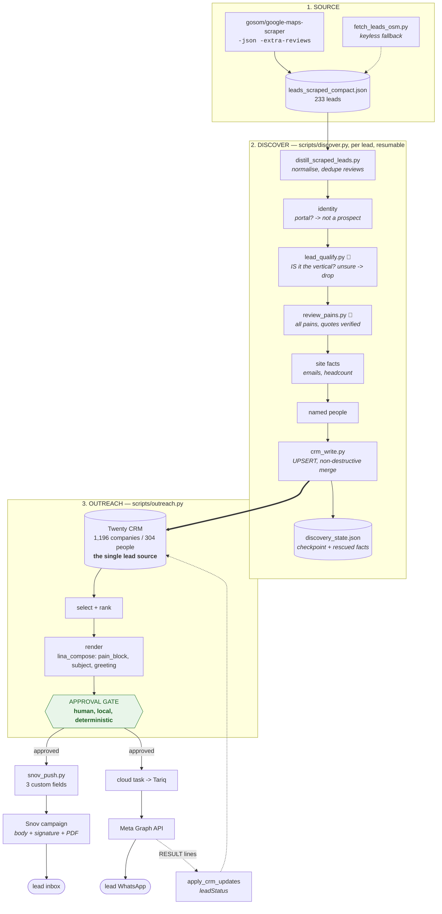
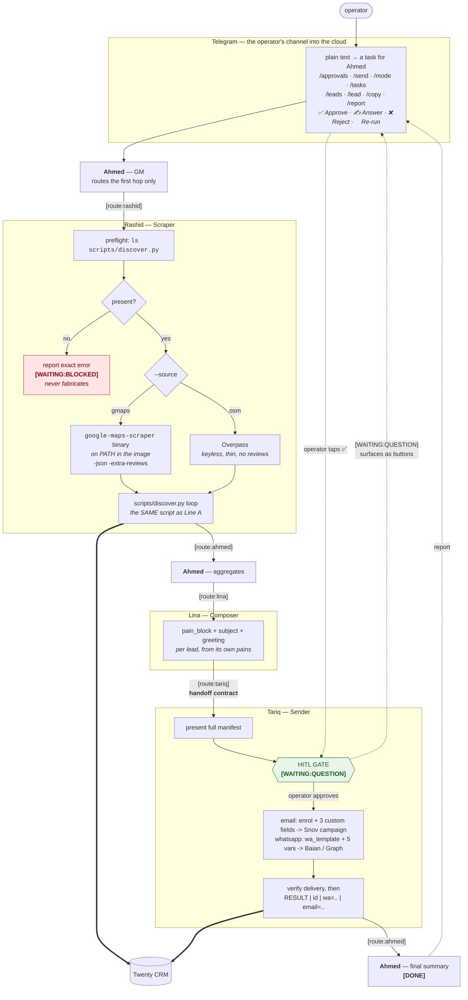

# The two pipelines — what runs locally today, and what runs in the cloud after the PR

Two lines through the same work. **Line A** is what executes today from the operator's
laptop. **Line B** is what executes in the cloud once the PR is deployed. They share every
deterministic step: the same scripts, the same CRM, the same approval gate. What changes is
*who invokes them* — a human running a command, or an agent running the same command.

That is the point of script-authority (`workforce/POSTMORTEM_2026-07-14.md`): the cloud task
is a literal execution checklist, so porting it is a change of caller, not a rewrite.

Verified against the live system on 2026-07-22. Where something is unproven, it says so.

---

## Line A — LOCAL today (script-authority)



### Where Line A breaks

| # | Break | Effect | Status |
|---|---|---|---|
| 1 | **Enrichment unproven** — every run so far reported `pages fetched=0` | site facts (emails, headcount) and named people have never executed against a real site. 143 of 233 leads DO have own sites | **open** |
| 2 | ~~`MY_OPENROUTER_KEY` dead and tried FIRST~~ | ~~composer silently fell back to library copy~~ | **FIXED 2026-07-22** — key removed from `.env`, all callers now go through `nav_env.openrouter_key()`, which reads ONE name. No fallback chain: a 401 is now a real problem with the real key instead of a silent downgrade |
| 3 | **RTL broken on the CAMPAIGN path** | Arabic renders left-to-right in the delivered mail. The `outreach.py` path is fixed (RLE/PDF); the Snov-template path is not | **open, deferred by operator** |
| 4 | **Zoho IMAP disabled** | Snov shows 0 replies across all 62 campaigns. Every reply is invisible; `watch_replies.py` waits on the toggle | **operator/external** |
| 5 | **`schedule_id: 0`** on all three campaigns | a campaign will not actually send on a schedule | **open** |
| 6 | **Sender is still a personal Gmail** on the Real Estate campaign | must be `ops@navaia.sa` before ANY real lead | **open** |
| 7 | **`شاكراً لكم` fidelity** — local reconstruction appends a line Meta never sends | preview and send-copy digest overstate by one line | **open** |
| 8 | **`leads_scraped_compact.json` is TRACKED and holds real prospect names** | `check_no_leaks.py` REFUSES; PDPL exposure into the public mirror | **fixed by deletion — see below** |

**Not a break (corrected 2026-07-22):** "0 leads have an email" was true of the *scraped file*,
which never carried addresses. The CRM holds **113 people with a primary email** and 291 with
a phone. The email channel is addressable today.

### The LLM steps are ON by default (operator decision, 2026-07-22)

Both intelligence steps used to be opt-in flags, and both were therefore almost never on —
so discovery produced leads whose only "pain" was a keyword match, and the composer emitted
the vertical's stock paragraph while *looking* like it was generating. As the operator put
it: an agent whose reasoning step is disabled by default is not an agent.

- `discover.py --llm` → **default on** (`--no-llm` to skip). Reads EVERY review and names
  ALL the pains, not the loudest one. This is the step that makes a lead writable-about.
- `outreach.py --llm-pain` → **default on** (`--no-llm-pain` to fall back). Generates the
  per-lead coupled pain→solution block and the subject.

Both cost OpenRouter credit per lead; that is the cost of the step working at all. A missing
key no longer degrades quietly — `step_reviews` prints that extraction was skipped and that
the copy will be generic, because silent degradation is exactly what hid the dead key.

Verified live 2026-07-22 with a four-pain profile: `generated: True`, validators clean, and
the block wove slow replies, no follow-up and idle listings into one coupled sentence —
`solutions_used: ['slow_reply_lead', 'general']`.

**Key hygiene:** `MY_OPENROUTER_KEY` is gone from `.env` and every caller now resolves
`nav_env.openrouter_key()`, which reads ONE name. The fallback chain was deliberately not
replaced — trying a second key on 401 is what hid the dead one for a week. Live check:
$3.25 remaining of the $4 rolling cap.

**Data hygiene now settled:** all 233 leads are in the CRM (199 written, 24 skipped, 0
failed) and all 136 `pain_hints` are rescued into `discovery_state.json`, so the scraped
file is redundant and can be deleted. Twenty has no field for `place_id`, `rating`,
`review_count`, `category` or `pain_hints`, and its metadata API returns 403 for this key —
hence the local rescue rather than a CRM column.

---

## Line B — CLOUD after the PR is deployed



**Telegram is a real HITL channel, not a notifier.** `telegram_workforce_bot.py` renders any
task in `waiting_plan` / `waiting_question` / `waiting_blocked` and answers it: ✅ Approve on
a plan, ✍️ Answer on a question (the agent resumes WITH the reply), 🔁 Re-run on a blocker —
a blocked task cannot take an answer, the dependency has to be fixed first. Answers go via
`POST /approve` with a JSON body; a bodyless approve 422s. Plain text becomes a task for
Ahmed, so a whole run can be started from the phone. `/mode` switches sends between 🧪 TEST
(to the operator's own number) and 🔴 LIVE without a restart.

The gate stays channel-agnostic by operator decision: Telegram is *a* way to answer it,
never the only one.

It needs three env vars and a restart — `TELEGRAM_BOT_TOKEN`, `TELEGRAM_CHAT_ID`,
`BUSINESS_NF` — plus the integration record that was activated on 2026-07-22 (until then the
ACTIVE telegram record was an empty-config duplicate and the credentialed one sat inactive).

**Maps scraping now runs in the cloud.** `--source gmaps` invokes the `google-maps-scraper`
binary that `deploy/discovery/Dockerfile` already puts on PATH, writes NDJSON, and distils it
through the same reader as Line A. Before this the cloud could only use `--source osm` —
~30 phoned POIs with **no reviews** — so the review-grounded pain the composer depends on was
unreachable there. The binary was shipped in the image; nothing called it.

### The handoff contract (Lina → Tariq)

Composer emits **finished values**; sender re-renders nothing.

```
person_id, company, to, wa_template, wa_variables[5]    # {{1}}..{{5}}, in order
email: { to, subject_line, greeting, pain_block }        # only when the lead has an address
```

Email carries **variables, not a rendered body** — the body, signature and PDF live on the
Snov campaign and cannot be sent from code (Snov has no upload endpoint), so a rendered body
could never be what is actually delivered. The three field names must match what
`snov_push.py` pushes; a mismatch makes Snov skip the recipient **silently**.

### What Line B needs before it can run

| Need | Why | State |
|---|---|---|
| **Image ships `scripts/`** into `/app/workspace` | `/app/workspace` has no `scripts/` and no git, so `discover.py` cannot import. Rashid correctly reports `[WAITING:BLOCKED]` today | **THE blocker** |
| `deploy/discovery/Dockerfile` | gosom binary + Playwright chromium + crawl4ai in one image; 21 chromium libs are missing from the stock runtime | built, self-check 7/7 |
| `NAVAIA_STATE_DIR=/app/workspace/.navaia` | otherwise the checkpoint is lost per run and discovery is not resumable | **not set** |
| Env: `OPENROUTER_API_KEY`, `TWENTY_TOKEN`, Snov creds, `NF_BAIAN_*` | the composer, CRM and senders | present. `MY_OPENROUTER_KEY` must NOT be set in the cloud env — the code no longer reads it, but a stale one there is a live-key impostor waiting for someone to re-add the fallback |
| Agent prompts deployed | the 7 refactored payloads | **done 2026-07-22**, verified by re-fetch |
| Integration records correct | the ACTIVE record must hold credentials | zoho/telegram/snov/crm **fixed**; **baian deferred** — its active record is the empty twin, which is why it errors `Missing required fields: token` |
| Routing edges | `[route:...]` fails silently when an edge is absent | verified present |
| Snov campaigns: `schedule_id`, sender | a campaign with neither will not send, or sends from a personal Gmail | **open** |

### What is deliberately NOT in the PR

Referenced by name, never carried — these are handled outside the repo and shipping them
would bloat the PR with content it cannot change anyway:

- **WhatsApp template bodies** — approved and locked at Meta, addressed by template *name*.
- **Snov campaign bodies** — Snov is authoritative; the repo copy is a mirror that cannot
  change what Snov sends.
- **PDF attachments** — uploaded to the Snov campaign in the dashboard, not sent from code.
- **Scraped lead data** — real prospect names (PDPL); the CRM now holds it.

---

## Where the LLM belongs, and where it does not

Script-authority does NOT mean "no model". It means a model never owns a step that must be
identical every time. The split, settled 2026-07-22:

| step | who | why |
|---|---|---|
| the 200-lead loop, dedupe, CRM payloads, the approval gate | **Python** | must be identical every run, resumable, countable. A model stepping 200 leads exhausts `max_turns=25` partway and reports success for the ones it reached |
| **deciding the vertical** (`lead_qualify`) | **LLM** | judgement. `any(keyword in name)` cannot tell a carpentry workshop from a contracting firm — and it consistently did not |
| reading reviews and naming ALL the pains | **LLM** | judgement. Keyword matching found one pain; a real listing has four or five |
| writing the coupled pain→solution block and subject | **LLM** | judgement, per lead, matched against what NAVAIA actually solves |

`step_qualify` runs FIRST — before the pain call and before any crawl — so a lead we are
going to drop costs nothing. It cannot invent a vertical (anything outside the three active
names is discarded in Python), it never sees a RETIRED lead (which markets we sell to is an
operator decision, not a judgement call), "unsure" means drop, and on failure the keyword
guess stands so a dead key cannot empty the pipeline while looking like "no matches".

Live 5/5: carpentry workshop dropped, driving school dropped, a real general contractor
kept, retired clinic refused without a model call.

So Lina is genuinely a writer and Rashid genuinely reads — while neither is trusted with the
bookkeeping. Both lines run the same models on the same inputs; Line A invokes them through
`lina_compose` / `review_pains`, Line B through the agents. The copy will be equivalent in
kind, not byte-identical, and that is expected — it is generated per lead either way.

## The one-line difference

Line A: **a human runs `discover.py`, reads the render, and approves.**
Line B: **an agent runs `discover.py`, and the operator still approves.**

The gate never moves. It is the control that stopped 153 sends against a $0.91 balance on
2026-07-19 and refused a drained-account send on 2026-07-20, and it stays a human decision in
both lines.
